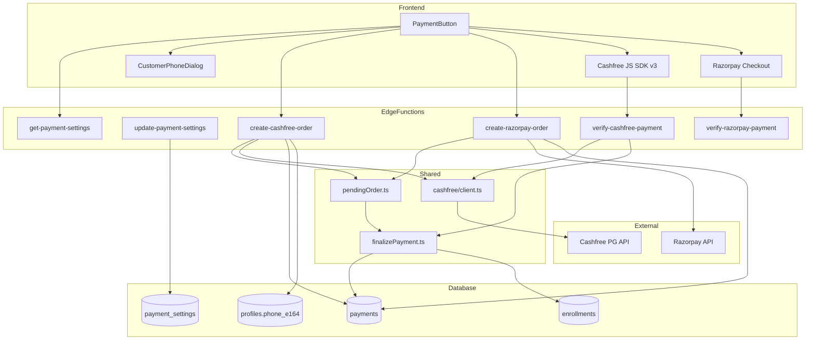

# Dual Payment Gateway — Razorpay + Cashfree

Reference document for the **Payment-gateway-integration** branch. Use this to explain design decisions, implementation details, and edge-case behavior — especially for **Cashfree as a backup INR gateway**.

---

## 1. Summary

| Question | Answer |
|----------|--------|
| **What problem does this solve?** | Razorpay remains the primary gateway. Cashfree is a **backup for INR course payments**, switchable by admin without redeploying. |
| **When is Cashfree used?** | Only when `payment_settings.cashfree_enabled = true` **and** checkout currency is **INR**. |
| **When is Razorpay used?** | Always for **USD**. For **INR** when Cashfree toggle is **off**. |
| **What payments are covered?** | **On-demand course checkout** (`PaymentButton` on course pages). |
| **What is NOT covered?** | Cohort registration payments, registration-form payments — still Razorpay-only. |
| **Where are secrets stored?** | Supabase Edge Function secrets only — **never** in frontend `.env`. |
| **How is payment confirmed?** | Client calls a **verify** edge function after checkout. **No webhooks** (v1). |

---

## 2. Design Goals & Decisions

### 2.1 Why a toggle instead of hard switch?

- **Zero-downtime rollback**: Admin can turn Cashfree off and all new INR checkouts return to Razorpay instantly.
- **Gradual rollout**: Test Cashfree in sandbox/production without removing Razorpay.
- **No code deploy to switch**: Toggle is a DB flag updated from Admin UI.

### 2.2 Why INR-only for Cashfree?

- Cashfree PG is built for Indian payments (UPI, cards, netbanking in INR).
- USD pricing continues on Razorpay (international cards).
- Keeps routing simple: **currency determines gateway when toggle is on**.

### 2.3 Why admin toggle + backend guards?

Defense in depth:

1. **Frontend** (`PaymentButton`) reads settings and routes to the correct create-order function.
2. **`create-razorpay-order`** rejects new INR orders when Cashfree is enabled (prevents bypass).
3. **`create-cashfree-order`** rejects when Cashfree is disabled.
4. **`update-payment-settings`** validates Cashfree env vars before allowing toggle ON.

Verify endpoints **never check the toggle** — a payment started under either provider must always be completable.

### 2.4 Why response-first routing on the frontend?

Both create-order endpoints can return a **resume** response for an existing pending payment, even if that pending order was created on the **other** provider (e.g. user started Razorpay, admin enabled Cashfree, user returns and clicks Pay).

The frontend branches on `response.provider`, not on which endpoint it called.

### 2.5 Why collect phone number?

Cashfree requires a **10-digit Indian mobile** on the order. We store it as E.164 (`+91XXXXXXXXXX`) on `profiles.phone_e164` and collect it once via `CustomerPhoneDialog` before the first Cashfree checkout.

### 2.6 Why no webhooks (v1)?

- Razorpay course payments already used client-triggered verify (no webhook).
- v1 keeps the same pattern for Cashfree: modal closes → `verify-cashfree-payment` polls Cashfree API.
- **Known gap**: if the user closes the browser before verify runs, payment may stay `created` until manual reconciliation or a future webhook/cron.

### 2.7 Why shared `finalizePaidPayment`?

Cashfree verify and Cashfree resume (order already PAID) both need the same logic:

1. Mark `payments.status = 'paid'`
2. Insert enrollment (idempotent — ignore duplicate key)

Razorpay verify still uses its own path (pre-existing); Cashfree uses the shared helper.

---

## 3. Routing Rules

### 3.1 Decision matrix

| Toggle | Currency | Gateway | Create-order function |
|--------|----------|---------|------------------------|
| OFF | INR | Razorpay | `create-razorpay-order` |
| OFF | USD | Razorpay | `create-razorpay-order` |
| ON | INR | **Cashfree** | `create-cashfree-order` |
| ON | USD | Razorpay | `create-razorpay-order` |

### 3.2 How currency is determined

**Regular users**

- `usePricingCurrency` hook → `get-pricing-currency` edge function
- GeoIP: Cloudflare `cf-ipcountry` → India = INR, else USD
- Fallback: ip-api.com; ultimate fallback = INR
- Cached in `sessionStorage` for 1 hour

**Admin users** (testing on course pages)

- Two explicit buttons: Pay INR / Pay USD
- `create-razorpay-order` accepts `body.currency` only when `isAdminUser()` is true
- INR button uses Cashfree when toggle is on; USD button always uses Razorpay

### 3.3 Routing flow (frontend)

```
User clicks Pay
  → fetchPaymentSettings()  [get-payment-settings]
  → effectiveCurrency = admin override OR geo pricing currency
  → useCashfree = cashfree_enabled && effectiveCurrency === "INR"
  → if useCashfree && no phone_e164 → CustomerPhoneDialog
  → invoke create-cashfree-order OR create-razorpay-order
  → branch on response.provider:
       razorpay  → Razorpay modal → verify-razorpay-payment
       cashfree  → Cashfree SDK modal → verify-cashfree-payment
```

**Key file:** `src/components/payment/PaymentButton.tsx`

---

## 4. Architecture



---

## 5. Database Schema

**Migration:** `supabase/migrations/20260827090000_cashfree_payment_settings.sql`

### 5.1 `payment_settings` (singleton)

| Column | Purpose |
|--------|---------|
| `id` | Always `1` (CHECK constraint) |
| `cashfree_enabled` | Admin toggle |
| `updated_at` | Shown in Admin UI |
| `updated_by` | Admin user who last changed toggle |

- RLS: authenticated users can **read**; only admins can **update**
- Default: `cashfree_enabled = false`

### 5.2 `payments` (extended)

| Column | Purpose |
|--------|---------|
| `provider` | `'razorpay'` or `'cashfree'` |
| `razorpay_order_id` | Nullable (Cashfree rows don't use it) |
| `cashfree_order_id` | Unique Cashfree order ID |
| `cashfree_payment_id` | Set on successful verify |
| `cashfree_payment_session_id` | For resume / SDK checkout |
| `cashfree_order_expiry_time` | 24h order TTL |

**Constraint:** each row must have the ID matching its provider:

```sql
(provider = 'razorpay' AND razorpay_order_id IS NOT NULL) OR
(provider = 'cashfree' AND cashfree_order_id IS NOT NULL)
```

**Concurrency:** partial unique index — at most one `status = 'created'` payment per `(user_id, course_id)`. Prevents duplicate open checkouts and enables safe resume.

### 5.3 `profiles.phone_e164`

- E.164 format, e.g. `+919876543210`
- Required before Cashfree order creation (backend enforces)
- Collected via `CustomerPhoneDialog` on first Cashfree checkout

---

## 6. Backend — Edge Functions

All payment functions use `verify_jwt = false` in `supabase/config.toml`; auth is manual via Bearer token in `getAuthUser()`.

### 6.1 `create-cashfree-order`

**Path:** `supabase/functions/create-cashfree-order/index.ts`

| Step | Action |
|------|--------|
| 1 | Auth + validate `course_id`, `currency === "INR"` |
| 2 | Load course price in paise; reject free / already paid |
| 3 | **`findPendingPayment` → `buildResumeResponse`** (before toggle check) |
| 4 | Check `cashfree_enabled`; reject if off |
| 5 | Require `profiles.phone_e164` |
| 6 | Create Cashfree order via API (amount in **rupees** on API, **paise** in DB) |
| 7 | Insert `payments` row: `provider: 'cashfree'`, `status: 'created'` |
| 8 | On unique violation (`23505`): retry resume |

**Order ID format:** `cf_{courseId8}_{timestamp}` (max 50 chars)

**Expiry:** 24 hours (`orderExpiryIso(24)`)

### 6.2 `verify-cashfree-payment`

**Path:** `supabase/functions/verify-cashfree-payment/index.ts`

| Step | Action |
|------|--------|
| 1 | Auth + validate `cashfree_order_id` |
| 2 | Load payment; verify ownership + `provider === 'cashfree'` |
| 3 | If already `paid` → idempotent `finalizePaidPayment` |
| 4 | Poll Cashfree: `getCashfreeOrder` |
| 5 | If `ACTIVE` → return `{ success: false, status: "pending" }` |
| 6 | If not `PAID` → return failure with order status |
| 7 | `getCashfreePayments` → find `payment_status === "SUCCESS"` |
| 8 | Validate amount (paise) and currency match DB record |
| 9 | `finalizePaidPayment` with `cashfree_payment_id` |

**No webhook signature** — purely API polling triggered by the client.

### 6.3 `get-payment-settings`

- Any authenticated user
- Returns `{ cashfree_enabled: boolean }`
- Defaults to `false` if row missing

### 6.4 `update-payment-settings`

- **Admin only** (`user_roles.role = 'admin'`)
- Body: `{ cashfree_enabled: boolean }`
- When enabling: calls `validateCashfreeConfig()` — all Cashfree env vars must exist
- Updates singleton row `id = 1`

### 6.5 `create-razorpay-order` (updated)

**Path:** `supabase/functions/create-razorpay-order/index.ts`

New behavior alongside existing Razorpay logic:

- Pending order resume via shared `pendingOrder.ts`
- Geo currency via `resolveCurrencyFromRequest`
- Admin can pass `body.currency` when `isAdminUser()`
- **Blocks new INR orders** when `cashfree_enabled` (returns 400)
- Inserts with `provider: 'razorpay'`

### 6.6 `get-payments` (updated)

- Course payments include `provider`, `cashfree_order_id`, `cashfree_payment_id`
- Cohort payments remain Razorpay-only (no provider column in cohort path)

---

## 7. Shared Helpers

### 7.1 `supabase/functions/_shared/cashfree/client.ts`

| Function | Purpose |
|----------|---------|
| `getCashfreeMode()` | `"sandbox"` unless `CASHFREE_ENV=production` |
| `validateCashfreeConfig()` | Ensures credentials exist before toggle ON |
| `cashfreeCustomerIdFromUserId()` | UUID without hyphens |
| `cashfreePhoneFromE164()` | `+91XXXXXXXXXX` → 10-digit national number |
| `createCashfreeOrder()` | POST `/orders` |
| `getCashfreeOrder()` | GET `/orders/{id}` |
| `getCashfreePayments()` | GET `/orders/{id}/payments` |
| `orderExpiryIso(hours)` | Default 24h expiry timestamp |

API hosts:

- Sandbox: `sandbox.cashfree.com/pg`
- Production: `api.cashfree.com/pg`

### 7.2 `supabase/functions/_shared/payments/pendingOrder.ts`

| Function | Purpose |
|----------|---------|
| `findPendingPayment()` | Latest `status='created'` for user + course |
| `expireIfStale()` | Mark `failed` if past expiry (24h TTL or Cashfree expiry) |
| `buildResumeResponse()` | Provider-specific resume payload |
| `resumeCashfree()` | Poll Cashfree; if PAID → finalize + `already_paid`; if expired → `failed` + `PENDING_EXPIRED` |
| `getPaymentSettings()` | Read singleton toggle |

### 7.3 `supabase/functions/_shared/payments/finalizePayment.ts`

- `finalizePaidPayment()`: `status → paid` + `ensureEnrollment()` (ignores duplicate enroll `23505`)
- Used by `verify-cashfree-payment` and Cashfree resume path

---

## 8. Frontend — Cashfree Module

**Directory:** `src/cashfree/`

| File | Role |
|------|------|
| `loadCashfree.ts` | Lazy-loads `https://sdk.cashfree.com/js/v3/cashfree.js` |
| `checkout.ts` | Opens Cashfree modal: `redirectTarget: '_modal'` |
| `types.ts` | `CreateOrderResponse` union + `Window.Cashfree` types |
| `CustomerPhoneDialog.tsx` | Collects 10-digit Indian mobile; saves to profile |
| `phone.ts` | `normalizeIndianPhone()` — validates `[6-9]` prefix, stores `+91…` |

### 8.1 `PaymentButton` states

Status machine (from main branch, preserved with Cashfree):

- `idle` → `opening` → `confirming` → `success`
- Confetti on success; `payment.failed` handler for Razorpay
- iOS UPI intent hidden for INR Razorpay checkouts

### 8.2 Admin checkout testing

When `isAdmin`, course page shows:

- Pay INR button (Cashfree if toggle on)
- Pay USD button (always Razorpay)
- Enroll as admin (bypass payment)

---

## 9. API Contract — `CreateOrderResponse`

Defined in:

- Backend: `supabase/functions/_shared/payments/types.ts`
- Frontend: `src/cashfree/types.ts`

```typescript
type CreateOrderResponse =
  | {
      provider: "razorpay";
      razorpay_order_id: string;
      key_id: string;
      amount: number;       // paise or cents
      currency: string;
      course_name: string;
      resumed?: boolean;
    }
  | {
      provider: "cashfree";
      cashfree_order_id: string;
      payment_session_id: string;
      cashfree_mode: "sandbox" | "production";
      amount: number;       // paise
      currency: string;
      course_name: string;
      resumed?: boolean;
    }
  | {
      provider: "cashfree";
      already_paid: true;
      course_id: string;
    };
```

All create endpoints wrap success as: `{ success: true, ...CreateOrderResponse }`.

---

## 10. Edge Cases — How We Handle Them

### 10.1 Admin toggles Cashfree while user has an open checkout

**Pending resume runs before the toggle gate** in both create-order functions.

- User with pending **Razorpay** order can resume even if Cashfree is now ON.
- User with pending **Cashfree** order can resume even if Cashfree is now OFF.
- Frontend handles any `provider` in the response regardless of which endpoint was called.

### 10.2 User clicks Pay twice quickly

- Partial unique index: only one `status = 'created'` per user + course.
- Second insert gets `23505` → code retries `findPendingPayment` + resume instead of creating a duplicate.

### 10.3 Cashfree order expired

- `resumeCashfree()` checks Cashfree `order_status` and `cashfree_order_expiry_time`.
- If expired: mark payment `failed`, throw `PENDING_EXPIRED` → create flow continues and makes a **new** order.

### 10.4 Payment completed on Cashfree but user never hit verify

- Resume path: next Pay click calls `getCashfreeOrder`; if `PAID`, server finalizes and returns `already_paid: true`.
- If user never returns: payment stays `created` (same gap as Razorpay without webhooks).

### 10.5 User already paid but DB still says `created`

- Resume detects Cashfree `PAID` → `finalizePaidPayment` → frontend gets `already_paid`.

### 10.6 Phone missing at checkout

- Frontend: dialog before create-order.
- Backend: `400 "Phone number required for Cashfree checkout"` if bypassed.

### 10.7 Amount tampering

- Verify compares Cashfree payment amount (converted to paise) and currency against the DB `payments` row.
- Mismatch → `400`.

### 10.8 Toggle ON without Cashfree credentials

- `update-payment-settings` calls `validateCashfreeConfig()` and rejects with error.
- Toggle cannot be enabled without valid secrets.

### 10.9 Verify endpoint and toggle

- **Verify never checks `cashfree_enabled`.** A payment in flight must always be verifiable.

---

## 11. Admin UX

**Location:** Admin → **Payments** tab (`src/pages/Admin.tsx`)

### Payment Gateway card

- Switch: **Use Cashfree for INR payments**
- Description: INR → Cashfree when on; USD always Razorpay
- Shows last updated timestamp
- Optimistic UI with rollback on API failure
- Calls `POST /functions/v1/update-payment-settings`

### Payments table

- Filter by course or cohort
- **Provider** column (`razorpay` / `cashfree`)
- Order ID / Payment ID columns show the correct provider fields
- CSV export includes Provider column

---

## 12. Security

| Topic | Approach |
|-------|----------|
| Cashfree secrets | Edge function env only — not exposed to browser |
| Auth | Bearer JWT validated in each edge function |
| Order ownership | Verify checks `payment.user_id === auth user` |
| Admin toggle | `user_roles.role = 'admin'` + RLS on `payment_settings` |
| Amount integrity | Server sets amount from course price; verify re-checks against Cashfree API |
| Phone PII | Stored on `profiles`; only sent to Cashfree at order creation |

---

## 13. Environment & Deployment

### 13.1 Supabase Edge Function secrets

| Secret | Required | Default | Notes |
|--------|----------|---------|-------|
| `CASHFREE_APP_ID` | To enable Cashfree | — | `x-client-id` |
| `CASHFREE_SECRET_KEY` | To enable Cashfree | — | `x-client-secret` |
| `CASHFREE_ENV` | No | `sandbox` | `sandbox` or `production` |
| `CASHFREE_API_VERSION` | No | `2023-08-01` | API version header |
| `RAZORPAY_KEY_ID` | Yes | — | Existing |
| `RAZORPAY_KEY_SECRET` | Yes | — | Existing |

### 13.2 Deploy checklist

1. Run migration `20260827090000_cashfree_payment_settings.sql`
2. Set Cashfree secrets in Supabase
3. Deploy edge functions:
   - `create-cashfree-order`
   - `verify-cashfree-payment`
   - `get-payment-settings`
   - `update-payment-settings`
   - Updated: `create-razorpay-order`, `get-payments`
4. Test in sandbox with toggle OFF (Razorpay INR) and ON (Cashfree INR)
5. Enable toggle in Admin when ready for production

### 13.3 Frontend `.env`

No Cashfree keys needed. Only existing `VITE_SUPABASE_*` vars.

---

## 14. Out of Scope (v1)

| Item | Status |
|------|--------|
| Cashfree webhooks | Not implemented |
| Razorpay webhooks | Not implemented (pre-existing) |
| Cohort payments via Cashfree | Razorpay only |
| Registration form payment via Cashfree | Razorpay only |
| Refunds | Not implemented |
| Client-side retry if verify returns `pending` | Single verify attempt |
| Cashfree checkout error handling | SDK result mostly ignored; verify runs after modal |

---

## 15. FAQ — Quick Answers

**Q: Why add Cashfree if we already have Razorpay?**  
A: Backup/redundancy for INR. If Razorpay has issues or we want to A/B or switch INR traffic, admin toggles without a deploy.

**Q: Does USD ever go through Cashfree?**  
A: No. Cashfree create-order rejects non-INR.

**Q: What happens if I turn Cashfree off mid-checkout?**  
A: Existing pending orders resume on their original provider. Only **new** orders follow the updated toggle.

**Q: Why is phone required?**  
A: Cashfree order API requires Indian mobile. We collect once and reuse from profile.

**Q: Are amounts in paise or rupees?**  
A: **Database and Razorpay**: paise. **Cashfree API**: rupees (converted in `createCashfreeOrder`). Verify converts back to paise for comparison.

**Q: How do I test Cashfree locally?**  
A: Set `CASHFREE_ENV=sandbox`, use sandbox credentials, enable toggle in Admin, pay INR on a course page.

**Q: How do I know which gateway a payment used?**  
A: `payments.provider` column and Admin Payments table Provider badge.

**Q: Can a user have two open orders for the same course?**  
A: No. Partial unique index enforces one `created` payment per user + course.

**Q: What if verify returns pending?**  
A: User sees a toast. They can click Pay again — resume logic will re-check Cashfree order status.

**Q: Is the toggle stored securely?**  
A: Yes — `payment_settings` table with RLS; only admins can update.

**Q: Do we need Cashfree keys in the frontend?**  
A: No. Server creates orders and returns `payment_session_id`; SDK only opens the checkout modal.

---

## 16. File Index

| Area | Path |
|------|------|
| Migration | `supabase/migrations/20260827090000_cashfree_payment_settings.sql` |
| Create Cashfree | `supabase/functions/create-cashfree-order/index.ts` |
| Verify Cashfree | `supabase/functions/verify-cashfree-payment/index.ts` |
| Get settings | `supabase/functions/get-payment-settings/index.ts` |
| Update settings | `supabase/functions/update-payment-settings/index.ts` |
| Razorpay create (updated) | `supabase/functions/create-razorpay-order/index.ts` |
| Get payments (updated) | `supabase/functions/get-payments/index.ts` |
| Cashfree API client | `supabase/functions/_shared/cashfree/client.ts` |
| Pending / resume | `supabase/functions/_shared/payments/pendingOrder.ts` |
| Finalize + enroll | `supabase/functions/_shared/payments/finalizePayment.ts` |
| Backend types | `supabase/functions/_shared/payments/types.ts` |
| Payment button | `src/components/payment/PaymentButton.tsx` |
| Cashfree frontend | `src/cashfree/` |
| Admin UI | `src/pages/Admin.tsx` |
| DB types | `src/integrations/supabase/types.ts` |
| Function config | `supabase/config.toml` |

---

## 17. End-to-End Cashfree Happy Path

```
1. User (India, toggle ON) clicks "Pay ₹X" on course page
2. PaymentButton → get-payment-settings → cashfree_enabled: true
3. No phone on profile → CustomerPhoneDialog → save phone_e164
4. create-cashfree-order:
     - no pending order
     - Cashfree API creates order
     - INSERT payments (provider=cashfree, status=created)
5. Cashfree SDK opens modal with payment_session_id
6. User completes UPI/card payment
7. verify-cashfree-payment:
     - Cashfree order_status = PAID
     - amount/currency match
     - finalizePaidPayment → paid + enrollment
8. PaymentButton → confetti, "Payment successful", course unlocked
```

---

*Branch: `Payment-gateway-integration` · Last updated: August 2026*
